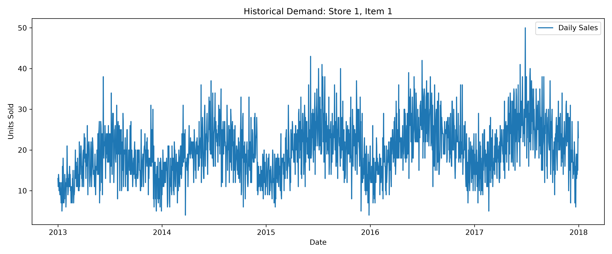
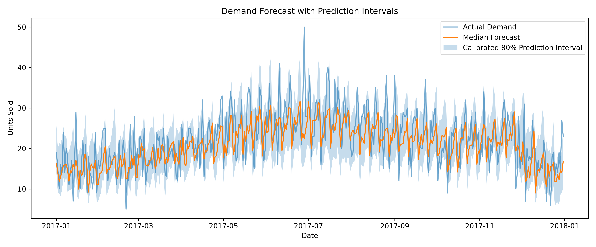
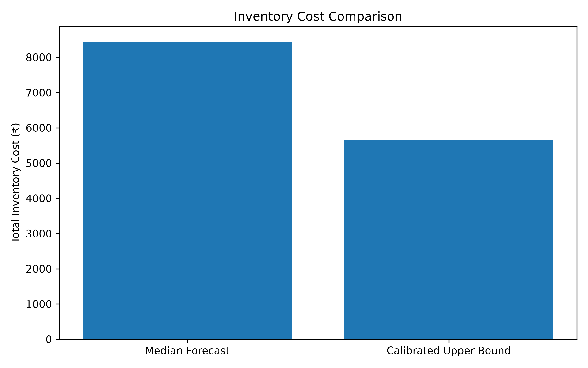

# Demand Forecasting with Uncertainty

A demand forecast usually gives you one number, but actual sales can end up being higher or lower. I wanted to see whether predicting a range of possible sales would be more useful than predicting a single value, especially when deciding how much stock to keep.

I started with a basic LightGBM forecasting model and then built a version that predicts the 10th, 50th, and 90th percentiles of daily demand. I also used conformal calibration to adjust the prediction intervals and tested two stocking strategies using a simple inventory cost simulation.

## Dataset

I used the [Store Item Demand Forecasting Challenge](https://www.kaggle.com/competitions/demand-forecasting-kernels-only) dataset from Kaggle.

For this project, I focused on **Item 1 at Store 1** rather than forecasting demand for every item and store.

## How it works

The models use the date, sales from previous days, and 7-day and 30-day rolling averages to predict daily demand.

I split the data by year:

- **2013–2015:** Train the models
- **2016:** Calibrate the prediction intervals
- **2017:** Test the results

The main model predicts three values for each day:

- **P10:** A lower estimate of demand
- **P50:** The median forecast
- **P90:** An upper estimate of demand

I used the 2016 data to adjust the prediction intervals toward a target coverage of 80%.

The project also compares stocking according to the median forecast with stocking according to the calibrated upper bound. For the simulation, I assumed an overstock cost of ₹2 per unit and a stockout cost of ₹8 per unit.

## Results

On the 2017 test data, the baseline regression model had an MAE of **4.33** and an RMSE of **5.51**.

The quantile model's median forecast had an MAE of approximately **4.17** and an RMSE of approximately **5.29**.

Calibration made the prediction intervals wider but improved how often they contained actual sales. The inventory simulation also showed a lower modeled cost when stocking according to the calibrated upper bound instead of the median forecast.

The full results are saved in [`results/metrics.json`](results/metrics.json), and the daily predictions are in [`results/predictions.csv`](results/predictions.csv).

## Plots

### Historical sales



### Forecast with prediction intervals



### Inventory cost comparison



The `results` folder also contains the rolling-average and baseline-forecast plots.

## Running the project

Download the dataset from the Kaggle link above and place `train.csv` inside a folder named `data`.

Install the required packages:

```bash
pip install -r requirements.txt
```

Then run:

```bash
python explore.py
python forecast.py
python main.py
```

The scripts save their plots and results in the `results` folder.

## What I'd improve

Right now, the project only looks at one item in one store. It also makes **one-day-ahead predictions** using sales from previous days, rather than predicting an entire year in advance.

I'd like to extend it to more items and stores, test how well the intervals work during demand spikes, and make the inventory simulation more realistic by including things like delivery times and stock limits.

The inventory costs in this project are hypothetical, so the simulated savings shouldn't be treated as actual business savings.